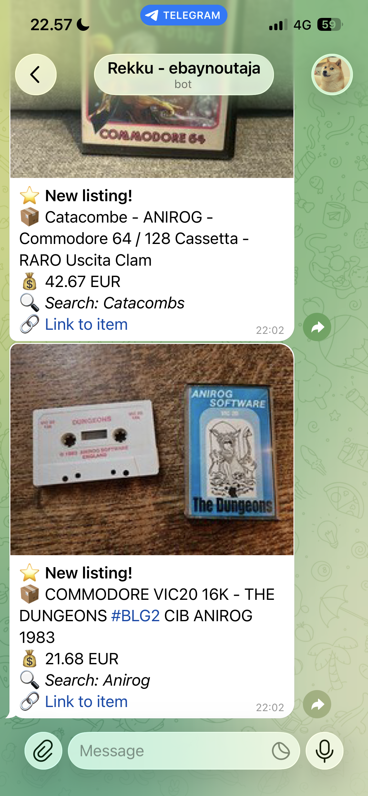
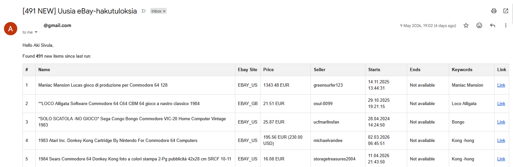

# fastebaysearch

`fastebaysearch` is a command-line Python tool for running large numbers of searches across multiple eBay marketplaces.

When run as a scheduled task, it provides a more powerful and flexible alternative to eBay’s own saved search alerts, especially for collectors tracking many specific items.

The tool searches configured marketplaces, stores seen item IDs in a local SQLite database, and reports only new results by email, Telegram, or local HTML report files.

**Telegram**



**Email**



`fastebaysearch` is based on the original **ebaysearch** script version 0.4.0 by Kalevi Kolttonen.

It continues the original idea of configurable eBay searches, SQLite-based tracking, and email notifications with a refactored asynchronous codebase, eBay Browse API support, Telegram notifications, HTML reports, retry handling, exchange-rate caching, stronger validation, and expanded tests.

Original project:  
https://kolttonen.fi/computers_and_logic/programming/ebaysearch/ebaysearch.html

## Features

- Asynchronous search execution for faster bulk searches and scheduled monitoring runs.
- Search multiple configured eBay marketplaces in one run. Each marketplace/query combination uses its own paginated API requests.
- eBay Browse API search monitoring for configured marketplaces.
- Local SQLite database for tracking seen items and search history.
- Comprehensive email reports, local HTML report files, and Telegram notifications with details and links for new results.
- Telegram image notification support.
- Currency conversion support with SQLite-cached exchange rates, so they do not need to be fetched on every run.
- Configurable search terms, required and excluded terms, notification limits, parallel API request limits and more.

## Requirements

- Python 3.11 or newer and Git available on your command line.
- An eBay Developer account and production application credentials (`Client ID` and `Client Secret`) with access to the Browse API. The script uses production eBay endpoints.
- SMTP credentials if email notifications are enabled.
- A Telegram bot token and chat ID if Telegram notifications are enabled. See instructions: https://www.youtube.com/watch?v=SmckRL4n1_8&t=26s
- A small server, such as a Raspberry Pi, should work fine.

## Installation

Choose a directory where you want to keep the project. These commands create a new checkout and copy its example configuration; edit the copy for your own use.

### Debian / Ubuntu

Install Git and Python tooling, then check the Python version:

```bash
sudo apt update
sudo apt install -y git python3 python3-venv python3-pip
python3 --version
```

The version must be at least 3.11. If your distribution provides an older version, install a supported Python version before continuing.

```bash
git clone https://github.com/Rakki1/fastebaysearch.git
cd fastebaysearch
python3 -m venv .venv
.venv/bin/python -m pip install --upgrade pip
.venv/bin/python -m pip install -r requirements.txt
cp ebaysearch.example.json ebaysearch.json
```

### Windows PowerShell

Install Git and Python if needed, then check that both are available and Python is at least 3.11:

```powershell
git --version
python --version
```

```powershell
git clone https://github.com/Rakki1/fastebaysearch.git
Set-Location fastebaysearch
python -m venv .venv
.\.venv\Scripts\python.exe -m pip install --upgrade pip
.\.venv\Scripts\python.exe -m pip install -r requirements.txt
Copy-Item ebaysearch.example.json ebaysearch.json
```

All remaining commands run from this project directory. They call the virtual environment's Python directly, so activation is unnecessary. This still uses the virtual environment and its installed dependencies.

## First HTML search

Open `ebaysearch.json` in a text editor. **The copied example enables email**, so turn it off for the first check. Update the following fields in the existing JSON object; keep its other fields. The narrow collector search below is an example you can replace with your own terms:

```json
{
  "use_email": false,
  "use_telegram": false,
  "use_html_report": true,
  "html_report_dir": "reports",
  "html_report_max_per_run": 1000,
  "log_to_console": true,
  "ebay_client_id": "your-production-client-id",
  "ebay_client_secret": "your-production-client-secret",
  "ebay_sites": ["EBAY_GB"],
  "ebay_buying_options": ["FIXED_PRICE", "AUCTION"],
  "ebay_search_keywords": {
    "base_terms": ["Slapshot"],
    "required_terms": ["commodore", "c64"]
  }
}
```

Replace both eBay credential placeholders. No SMTP or Telegram credentials are needed while those channels are disabled; their placeholder fields can remain in the copied configuration. Save valid JSON without comments or trailing commas.

First estimate usage without making network calls:

Debian / Ubuntu:

```bash
.venv/bin/python fastebaysearch.py ebaysearch.json --estimate-api-budget
```

Windows PowerShell:

```powershell
.\.venv\Scripts\python.exe fastebaysearch.py ebaysearch.json --estimate-api-budget
```

If the estimate and query validation succeed, preview the current results:

Debian / Ubuntu:

```bash
.venv/bin/python fastebaysearch.py ebaysearch.json --clean-search
echo $?
```

Windows PowerShell:

```powershell
.\.venv\Scripts\python.exe fastebaysearch.py ebaysearch.json --clean-search
$LASTEXITCODE
```

The second command prints the preceding command's exit code. Check it immediately: `0` means success, `1` means an error or incomplete results/report, and `2` means eBay rate limiting. See [Logs and troubleshooting](#logs-and-troubleshooting) for details.

With these settings, open the newest `reports/ebay_report_*.html` in your browser. The log is `fastebaysearch.log` in the project directory. A successful search with zero results creates no HTML file. The first actual search requests an OAuth token and caches it in `oauth_token.json`.

Clean search is a preview: it does not read or write SQLite, mark items as seen, or send email/Telegram notifications. It does write logs, a token cache when needed, and an HTML report when results exist. It always writes HTML regardless of `use_html_report`.

If `html_report_max_per_run` omits results, the report and log show the found/reported counts and the command returns `1`. Clean search has no delivery queue; increase the limit or narrow your search for a complete report.

## Start monitoring and enable notifications

After checking the preview, choose your notification channels below and run normally.

Debian / Ubuntu:

```bash
.venv/bin/python fastebaysearch.py ebaysearch.json
echo $?
```

Windows PowerShell:

```powershell
.\.venv\Scripts\python.exe fastebaysearch.py ebaysearch.json
$LASTEXITCODE
```

On a new database, the first normal run treats all matching items as new. **A previous clean search does not suppress this initial batch.** You can keep the first-run settings for HTML-only monitoring or enable email/Telegram before running. Check the log and output before [scheduling runs](#scheduled-runs-with-cron).

Notification delivery is tracked separately for each channel. An email delivery does not mark a Telegram notification as delivered. Enabling Telegram later can therefore send previously stored items that are still pending for Telegram, including items discovered while Telegram was disabled. Email likewise processes its own pending history. Keep a per-run limit that suits the initial batch.

HTML behaves differently: only items first discovered while HTML is enabled enter its queue. Enabling HTML later does not retrospectively queue existing history. See [HTML delivery queue](#html-delivery-queue).

### Email

To enable email, set `use_email` to `true` and replace the copied example's SMTP and email placeholders:

- Set `smtp_server` and `smtp_port` to your provider's SMTP submission settings. The current client supports SMTP with optional STARTTLS, not implicit TLS (`SMTP_SSL`).
- Set `smtp_starttls_encryption` and `smtp_authentication` as required by your provider. The example uses port 587, STARTTLS and authentication.
- Fill in `smtp_login` and `smtp_password` with the credentials your provider accepts, such as an app password where required.
- Set `email_sender`, `email_receiver`, `email_subject` and `email_person_name`.
- Set `email_max_per_run` to limit the number of pending items included in one run's email. The example and the fallback default are 1,000.

The current configuration loader requires non-empty SMTP login/password and email identity fields whenever email is enabled, even if SMTP authentication is disabled. Leave email disabled for an HTML-only setup.

### Telegram

To enable Telegram, set `use_telegram` to `true`, fill in `telegram_token` and `telegram_chat_id`, and set an explicit `telegram_max_per_run`. See the linked [setup walkthrough](https://www.youtube.com/watch?v=SmckRL4n1_8&t=26s) if you need help obtaining the bot details.

The example configuration sets `telegram_max_per_run` to **25 items**; if the field is absent, the program's fallback default is **1,000 items**. A header message is additional, and a failed photo request may also trigger a text fallback request. The item limit is not a strict count of all Telegram API calls.

Choose `telegram_send_mode`:

- `auto` or `photo`: use an image when available, otherwise text; a rejected photo response can fall back to text.
- `photo_only`: skip items without an image and do not fall back to text.
- `text`: send text only.

Set `telegram_disable_web_preview` to `true` to disable link previews in text messages. Previously delivered items are not deliberately re-sent; failed item attempts become eligible again after six hours, up to three claimed attempts. Items exceeding that attempt limit remain in the database but are not automatically retried.

## Run modes

All modes load and validate the configuration, including credentials for enabled channels. Disable email/Telegram for a preview when you have not configured their credentials.

| Mode | API calls | SQLite | Output |
| --- | --- | --- | --- |
| Normal run (no flag) | eBay searches, OAuth as needed, exchange rates on cache miss | Reads/writes history, seen items and delivery state | Enabled HTML, email and Telegram channels, including pending deliveries |
| `--clean-search` | eBay searches, OAuth as needed, live exchange rates | No access | Local HTML preview only; no email/Telegram or delivery queue |
| `--estimate-api-budget` | None | No access | Console estimate only; no token cache, log file or notifications |

`--clean-search` and `--estimate-api-budget` cannot be combined.

## Configuration reference

Use `ebaysearch.json` for your own searches, eBay credentials and notification settings. The examples below show fields to merge into the existing JSON object, not separate configuration files.

### Buying options

| Listings to include | `ebay_buying_options` value |
| --- | --- |
| Fixed-price listings and auctions (default) | `["FIXED_PRICE", "AUCTION"]` |
| Fixed-price listings only | `["FIXED_PRICE"]` |
| Auctions only | `["AUCTION"]` |

If the field is missing, both options are included. An empty list or an unknown value is a configuration error. Both options are passed together in one filter for each marketplace/query request; the number of returned pages can still increase when auctions are included.

### Fields

Configuration file fields:

- `use_email`: enables or disables email notifications.
- `use_telegram`: enables or disables Telegram notifications.
- `use_html_report`: enables or disables local HTML reports and processing of the persistent HTML delivery queue.
- `html_report_dir`: local report directory, relative to the directory where the script is run. Defaults to the current working directory when omitted.
- `html_report_max_per_run`: maximum number of pending items written to an HTML report per normal run; remaining items stay queued.
- `telegram_max_per_run`: maximum number of pending items handled in one run; 25 in the example, 1,000 when omitted. The header and any photo fallback requests are additional.
- `telegram_token`: Telegram bot token used when Telegram notifications are enabled.
- `telegram_chat_id`: Telegram chat id where notifications are sent.
- `telegram_send_mode`: one of `auto`, `photo`, `photo_only`, or `text`.
- `telegram_disable_web_preview`: disables Telegram link previews for text messages when enabled.
- `ebay_sites`: eBay marketplaces to search, for example `EBAY_US`, `EBAY_GB`, `EBAY_DE`.
- `ebay_buying_options`: a non-empty list containing `FIXED_PRICE`, `AUCTION`, or both. Defaults to `["FIXED_PRICE", "AUCTION"]`, including for older configuration files. Both options use one combined search request.
- `exclude_terms`: terms excluded from generated search queries.
- `ebay_client_id`: eBay Developer application client id.
- `ebay_client_secret`: eBay Developer application client secret.
- `ebay_urls_dbfile`: SQLite database file name. The file is created under the project directory.
- `ebay_oauth_file`: OAuth token cache file name. The file is created under the project directory.
- `ebay_search_keywords`: search keyword configuration object.
- `ebay_search_keywords.base_terms`: base expressions; each list entry generates a separate query on every configured marketplace.
- `ebay_search_keywords.required_terms`: alternatives added as an OR group; at least one alternative is required, not all of them.
- `smtp_server`: SMTP server hostname used for email notifications.
- `smtp_port`: SMTP server port.
- `smtp_starttls_encryption`: enables or disables SMTP STARTTLS.
- `smtp_authentication`: enables or disables SMTP authentication.
- `smtp_login`: SMTP username.
- `smtp_password`: SMTP password.
- `email_sender`: email sender address.
- `email_receiver`: email recipient address.
- `email_subject`: subject line for result emails.
- `email_person_name`: recipient name used in email and clean-search report text.
- `email_max_per_run`: maximum number of pending email notification items handled in one run.
- `api_concurrency`: number of eBay API searches allowed to run concurrently.
- `exchange_rate_cache_ttl_hours`: exchange-rate cache lifetime in hours. Use `0` to disable the cache.
- `log_to_console`: also writes logs to stdout/stderr when enabled.
- `log_max_size_mb`: maximum size of `fastebaysearch.log` before rotation, in MiB. Defaults to `10`.
- `ebay_daily_api_limit`: your Browse API daily call budget; the program's calculation default is `10000`, not a guarantee of your eBay quota.
- `api_budget_safety_percent`: percentage of that budget available to the estimate, from 1 to 100; defaults to `90`.
- `estimated_results_per_query`: estimated results per marketplace/query; defaults to `200`. Used for the budget estimate only, not as a result limit.

Database, token and log paths must stay under the project directory. The script rejects configured paths that escape the project directory. The HTML report directory must be relative to the working directory and stay beneath it; the first-run instructions use the project directory so reports appear under `reports/`.

### Search expressions and coverage

Search terms separated by spaces retain eBay's AND semantics. For example, base term `camera` and required terms `["canon", "nikon"]` produce `("canon", "nikon") camera`. Expressions such as `(Slapshot, "Slap Shot")` and `Kong -hong` are preserved. Exclusions are appended to every query; an optional leading minus on a configured exclusion is normalized.

Every complete query, including all exclusions, must fit within eBay's 100-character limit. An overlong query is rejected with its base term, full text and length before logging, database access or API calls. This applies to normal runs, clean searches and budget estimates. Shorten the terms or split the configuration; no exclusions are silently discarded.

Searches use `sort=newlyListed` and fetch up to 10,000 items per marketplace/query. If more results exist, the run is marked partial and logs the affected query and fetched/reported counts. Narrow broad searches to improve coverage. Newest-first sorting cannot guarantee complete coverage beyond this API limit. Auction-only listings use the current bid amount, labelled `Current bid`; missing prices are displayed as `Price unavailable`.

HTTP 500/502/503/504, connection failures and timeouts receive up to two retries of the affected page, after 1 and 2 seconds. Concurrent HTTP 401 failures share at most one forced token refresh per run. Other permanent HTTP errors are not retried. HTTP 429 stops further searches and cancels outstanding requests. Results already received are still saved and delivered. Each query's outcome and overall completeness appear in the log; reports and notification summaries identify partial searches. A channel failure does not prevent the other notification channels from running.

### HTML delivery queue

When HTML is enabled, newly discovered items are queued in SQLite in the same transaction as their initial insertion. Each normal run writes the oldest pending items up to `html_report_max_per_run`, even if the current search finds nothing new. Excess items and failed writes remain pending for a later run. Successfully delivered items record the report path and delivery time.

Disabling HTML pauses processing of its existing queue. Items first discovered while HTML is disabled are not queued retrospectively. Upgrading an existing database starts with an empty HTML queue; historical items, including any previously missed reports, are not automatically replayed.

Report files are written atomically. A short SQLite write transaction protects each local report batch from concurrent delivery. A process crash after the file is finalized but before the database commit may produce a duplicate report on retry; items remain queued until delivery is confirmed.

## API budget and scheduling

The program defaults to **10,000 Browse calls per day for its calculation**. Check your own application's Browse quota and current usage in your eBay developer account and set `ebay_daily_api_limit` accordingly before scheduling. Changing this field does not change eBay's quota or enforce a local daily request counter.

These optional fields control the estimate:

```json
{
  "ebay_daily_api_limit": 10000,
  "api_budget_safety_percent": 90,
  "estimated_results_per_query": 200
}
```

Run `--estimate-api-budget` using the commands in [First HTML search](#first-html-search). The estimate uses the number of marketplaces, generated queries and expected result pages. Each marketplace/query combination makes a separate request for each page; a run is not one API call for all marketplaces.

The output shows estimated calls per run, possible runs per day and a recommended interval. It also shows a retry allowance at the estimated page count and the maximum Browse call count at the 10,000-result cap. OAuth calls are separate (0–2 per run). The recommended interval uses the normal estimate; allow headroom for retries, other applications using the same quota and higher result counts. This estimate is not a measurement of your actual usage.

### Scheduled runs with cron

After a successful manual run, use absolute paths and the same working directory for cron. Replace every `/home/user/fastebaysearch` with your checkout's absolute path. The following is a 30-minute example, not a universal interval recommendation:

```cron
*/30 * * * * cd /home/user/fastebaysearch && /home/user/fastebaysearch/.venv/bin/python /home/user/fastebaysearch/fastebaysearch.py /home/user/fastebaysearch/ebaysearch.json >> /home/user/fastebaysearch/cron.log 2>&1
```

Choose an interval that fits your API budget and leaves enough time for a run to finish. Avoid overlapping scheduled runs; SQLite delivery tracking does not make every notification channel immune to duplicate delivery. This command uses the virtual environment without activating it.

## Logs and troubleshooting

The script writes `fastebaysearch.log` in the project directory. It rotates at `log_max_size_mb` and retains up to five backups. With `log_to_console: true`, runtime messages also appear in the terminal. Configuration errors are printed before the log is opened.

Exit codes:

- `0`: all searches completed and attempted notifications/reports succeeded. Items safely queued beyond the normal HTML limit do not make the run fail.
- `1`: configuration, database, token, notification or other runtime error; also an incomplete search or truncated clean-search report.
- `2`: eBay rate limiting was encountered; takes precedence over notification/report failures. Results received before the search cancellation are still processed.

A failed or partial search is not equivalent to a successful search with zero results. Check the per-query status, reported/fetched counts and notification errors in the log.

| Symptom | What to check |
| --- | --- |
| Configuration error | Valid JSON, required fields for enabled channels, allowed paths, and the full query's 100-character limit |
| No HTML report | Whether the search succeeded with zero results; in normal mode, whether HTML is enabled and its queue has pending items |
| `PARTIAL SEARCH` or a 10,000-item cutoff | Affected queries and API errors in the log; narrow broad searches |
| Clean report contains fewer items than were found | `html_report_max_per_run`; clean search cannot queue the remainder |
| HTTP 401 | Production eBay credentials and application access; the run already attempts one shared token refresh |
| HTTP 429 / exit code 2 | Actual application quota and request frequency before the next run |
| Email or Telegram fails | Channel credentials, settings and logs; the other enabled channels are still attempted |

## Upgrading from 0.6.1

This README includes changes prepared for 0.6.2; that version is not yet released. Use instructions matching the code version you have installed.

Pause the scheduled task and make a SQLite backup before the first upgraded run. If copying database files directly, ensure every process using the database has stopped and retain any WAL files; SQLite's backup API is preferable for a consistent standalone backup. Schema upgrades are automatic, additive and transactional. Existing item history, email/Telegram delivery state and exchange rates are preserved.

The default now includes auctions, so the first upgraded run may discover additional items. Set `"ebay_buying_options": ["FIXED_PRICE"]` to retain the previous buying-format scope. The HTML queue starts empty for existing records: historical items, including previously missed HTML deliveries, are not replayed. Check the log and exit status after the first run, then resume scheduling.

## Local credentials

Copy `ebaysearch.example.json` to create your own configuration; keep real credentials out of Git. The default local configuration and token cache names are ignored. `konfiguraatio.json` is also an ignored personal filename, not a configuration supplied by the repository. Add custom credential or cache filenames to `.gitignore` before committing.

Tests use a credential-free collector-search fixture. Do not replace it with a live configuration.

## Tests

Install development dependencies and run the test suite from the project directory.

Debian / Ubuntu:

```bash
.venv/bin/python -m pip install -r requirements-dev.txt
.venv/bin/python -m pytest -q
```

Windows PowerShell:

```powershell
.\.venv\Scripts\python.exe -m pip install -r requirements-dev.txt
.\.venv\Scripts\python.exe -m pytest -q
```
